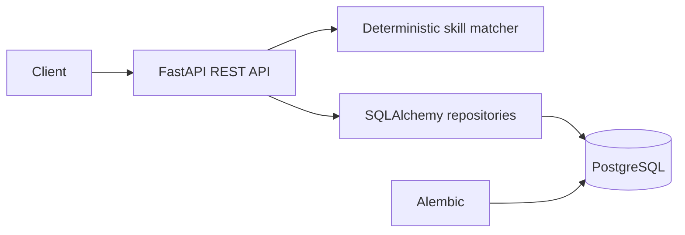

# AI Job Application Tracker

Production-style FastAPI backend for managing vacancies and application stages, comparing CV text with job requirements, and exposing funnel analytics. It solves a real candidate-operations problem while remaining useful without paid AI APIs.



## Features

- CRUD and search for job listings
- CV-to-description skill extraction, ATS-style score, and missing skills
- Saved, Applied, Interview, Offer, and Rejected workflow
- Application notes, validation, conflict handling, analytics, logs, and OpenAPI
- Optional LLM extension point without a runtime dependency on paid services

## Quick start

Requires Python 3.12+.

```bash
python -m venv .venv
source .venv/bin/activate  # Windows: .venv\Scripts\activate
pip install -e ".[dev]"
uvicorn job_tracker.main:app --reload
```

Open `http://localhost:8000/docs`. Production-style local deployment: `docker compose up --build`.

Environment variables are documented in `.env.example`. Never commit `.env`.

## API examples

```bash
curl http://localhost:8000/health
curl -X POST http://localhost:8000/jobs -H "Content-Type: application/json" -d '{"title":"Python Werkstudent","company":"Example GmbH","description":"Python FastAPI PostgreSQL Docker experience required"}'
curl -X POST http://localhost:8000/resume/analyze -H "Content-Type: application/json" -d '{"job_id":1,"text":"Python and FastAPI backend developer with Docker experience"}'
```

Run quality checks with `ruff format --check .`, `ruff check .`, and `pytest --cov=job_tracker`.

## Skills Demonstrated

Python, FastAPI, REST API design, PostgreSQL, SQLAlchemy, Alembic, Docker, Git, Linux, CI/CD, Pytest, deterministic NLP, validation, and layered software engineering.

## Relevance for German Werkstudent Roles

- Demonstrates a maintainable Python backend instead of a notebook prototype.
- Models a workflow relevant to HR-tech and internal business platforms.
- Shows database migrations, API contracts, automated tests, and CI/CD.
- Runs locally without transmitting CV data to a paid service.

## Limitations and roadmap

The matcher uses a curated taxonomy and does not infer semantic equivalents. Next steps are authentication, German-language normalization, background document parsing, and opt-in LLM enrichment. See `docs/` for architecture, API, setup, and decisions.

MIT licensed.
