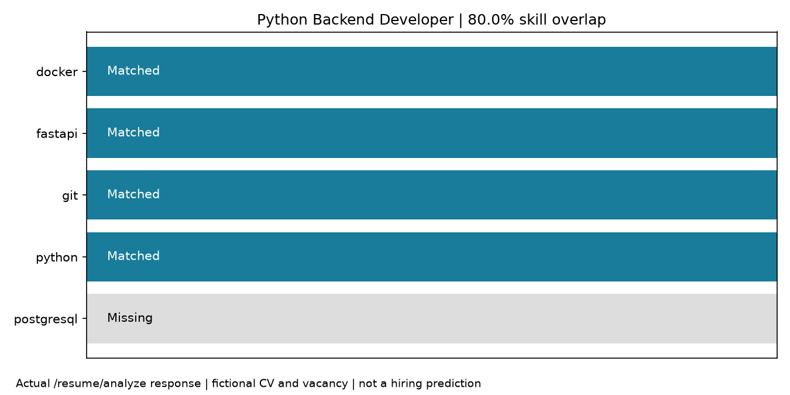
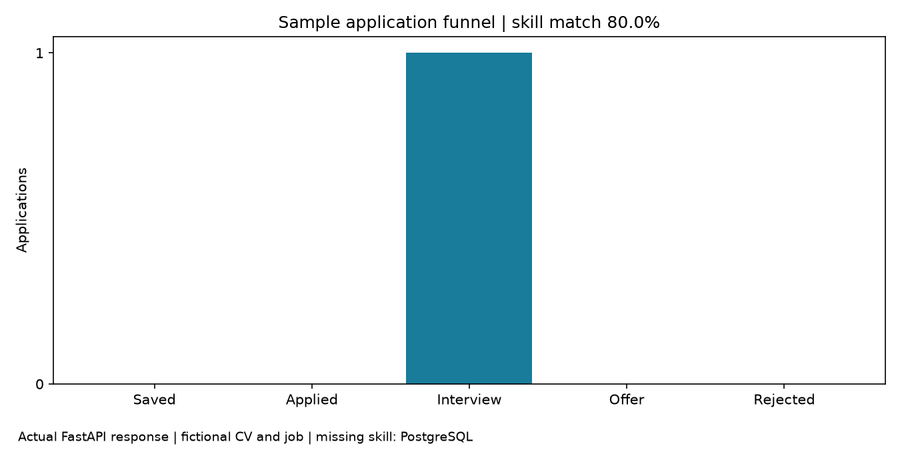

# AI Job Application Tracker

A FastAPI backend for storing vacancies, tracking application stages, and comparing CV skills with job requirements.

The example matches four of five required skills: Python, FastAPI, Docker, and Git.
PostgreSQL is missing. The 80% score is a transparent skill-overlap calculation,
not a prediction of an interview or an employer's screening result. Both the CV and vacancy are fictional.

## Application workflow

- Create and search vacancies, then attach one application to each job.
- Update the stage: Saved, Applied, Interview, Offer, or Rejected.
- Analyze CV text to return matched and missing skills.
- Read stage counts and the average saved match score from the analytics endpoint.

Jobs and applications are separate SQLAlchemy models. A database uniqueness constraint
prevents duplicate applications for one job. Stages are an enum; the API permits moving
between any stages rather than imposing a transition graph. Deleting a job also deletes its application.

## Matching

The matcher recognizes a small, explicit skill taxonomy using case-insensitive regular
expressions with word boundaries. It divides matched required skills by recognized required
skills; jobs with no recognized skills receive 0.0. It does not infer experience or synonyms
outside that taxonomy. Deterministic matching is the implemented baseline; no LLM is involved.
The repository name retains “AI,” but the current scoring is rule based.

Analyzing a CV saves the score only when the job already has an application.
The [recorded workflow](docs/results/demo.json) creates one application, moves it to Interview,
and verifies that analytics returns the saved score.

## Run locally

Use Python 3.12 or newer and activate a virtual environment.

~~~bash
python -m venv .venv
# Linux/macOS: source .venv/bin/activate
# PowerShell: .venv\Scripts\Activate.ps1
python -m pip install -e ".[dev,demo]"
uvicorn job_tracker.main:app --reload
~~~

Open [Swagger](http://localhost:8000/docs). SQLite is the default.
Set `JOB_TRACKER_DATABASE_URL` in an ignored `.env` to use another database.

With a fresh database and the API running, reproduce the charts and requests:

~~~bash
python scripts/demo_workflow.py
curl http://localhost:8000/analytics
~~~

For PostgreSQL, copy `.env.example` to `.env`, set a unique URL-safe
`POSTGRES_PASSWORD`, and run `docker compose up --build`.
The container runs Alembic migrations before starting the API.

## Implementation and checks

Python, FastAPI, Pydantic, SQLAlchemy, Alembic, SQLite/PostgreSQL.
Matplotlib is used only for demo charts.

~~~mermaid
flowchart LR
  Request[CV text / vacancy] --> API[FastAPI]
  API --> Match[Skill taxonomy]
  API --> DB[(Jobs and applications)]
  DB --> Analytics[Stage counts and saved scores]
~~~

~~~bash
ruff check .
ruff format --check .
pytest --cov=job_tracker --cov-report=term-missing
python -m pip check
~~~

The suite covers matching boundaries, API persistence and validation, duplicate applications,
cascade deletion, and migration round trips. [Test output](docs/results/tests.txt) and
[verification notes](docs/results/verification.md) record the executed checks.
CI also builds the container and exercises the API against PostgreSQL.

## Limits and next work

This is a single-user local backend: no authentication, ownership checks, pagination,
or PDF CV extraction. Add user isolation before hosting personal records.
The next useful matching improvement is a tested synonym vocabulary rather than a less explainable score.

[API contracts](docs/api.md) · [Setup and configuration](docs/setup.md) ·
[Design decisions](docs/decisions.md) · [Demo provenance](docs/results/provenance.md)
