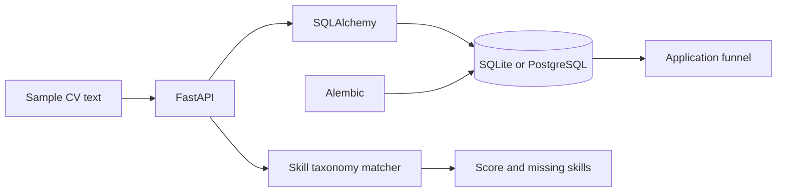

# AI Job Application Tracker

Track applications, compare CV skills with job requirements, and inspect application funnel analytics through a Python REST API.


   
[](https://github.com/faizansahi/ai-job-application-tracker/actions/workflows/ci.yml)

## Overview

A compact backend for a candidate's job-search workflow. Matching uses an explicit skill taxonomy and runs locally without paid AI services.

## Business Problem

Vacancies, CV requirements, and application stages are often scattered across spreadsheets and notes, making follow-up and skill gaps difficult to track.

## Solution

Keep jobs and applications in a relational model, calculate reproducible skill overlap, and expose stage counts and saved scores through FastAPI.

## Key Features

- Create, search, update, and delete job listings.
- Manage Saved, Applied, Interview, Offer, and Rejected stages.
- Return matched skills, missing skills, and a transparent percentage score.
- Persist match scores for existing applications; reject duplicates and invalid scores.
- Version the schema with Alembic and test the complete API workflow.

## Architecture



[Architecture details](docs/architecture.md) · [Engineering decisions](docs/decisions.md)

## Technology Stack

Python 3.12, FastAPI, Pydantic, SQLAlchemy, PostgreSQL/SQLite, Alembic, Docker Compose, Pytest, Ruff, and GitHub Actions.

## Demo / Results

The live demo created one fictional application, moved it to Interview, and returned an **80% skill overlap**: four of five listed skills matched, with PostgreSQL missing. The analytics endpoint returned the same saved score. This is a skill-overlap result, not an ATS acceptance prediction.

[Actual output](docs/results/demo.json) · [Test report](docs/results/tests.txt) · [Provenance](docs/results/provenance.md) · [Verification status](docs/results/verification.md)

Reproduce using a fresh local database and a running API:

```bash
python scripts/demo_workflow.py
```

## Installation

Requires Python 3.12+. From this repository:

```bash
python -m venv .venv
# Linux/macOS: source .venv/bin/activate
# Windows PowerShell: .venv\Scripts\Activate.ps1
python -m pip install -e ".[dev,demo]"
uvicorn job_tracker.main:app --reload
```

Open `http://localhost:8000/docs`. With no environment file, the API uses SQLite. See [setup](docs/setup.md).

## Docker Setup

Copy `.env.example` to `.env`, set a unique URL-safe `POSTGRES_PASSWORD`, then run:

```bash
docker compose up --build
```

Compose supplies PostgreSQL and persistent storage. The API binds to localhost port 8000; run one project's stack at a time. Docker was unavailable on the local Windows review machine; [verification status](docs/results/verification.md) records separate container checks.

## Environment Variables

| Variable | Default / requirement | Purpose |
|---|---|---|
| `JOB_TRACKER_DATABASE_URL` | `sqlite:///./job_tracker.db` | SQLAlchemy connection URL |
| `JOB_TRACKER_LOG_LEVEL` | `INFO` | Application logging level |
| `POSTGRES_PASSWORD` | Required for Compose | Local database password |

The app reads `.env`. Compose overrides the database URL with its internal PostgreSQL address. Keep real values out of Git.

## API Usage

Use Swagger or the following examples:

```bash
curl http://localhost:8000/analytics
curl -X POST http://localhost:8000/resume/analyze -H "Content-Type: application/json" -d '{"job_id":1,"text":"Sample Python FastAPI Docker Git experience"}'
```

[API / data contracts](docs/api.md).

## Tests

```bash
ruff format --check .
ruff check .
pytest --cov=job_tracker --cov-report=term-missing
python -m pip check
```

The recorded Windows run passed **5 tests** with **96% statement coverage**. Coverage describes this suite, not complete correctness.  GitHub Actions runs quality and container checks; its badge reports the current status.

## Project Structure

```text
src/job_tracker/     Application and domain logic
tests/                  Unit and integration tests
scripts/                Reproducible demos and clients
docs/                   Architecture, setup, API, decisions
docs/images/            Real screenshots and output visuals
docs/results/           Execution and test evidence
.github/workflows/      Automated checks
```

## Engineering Decisions

A deterministic taxonomy makes scoring explainable. SQLAlchemy dependencies allow isolated API tests. Database uniqueness protects against duplicate applications, and Alembic migrations read the same environment configuration as the app.

## Limitations

The taxonomy does not infer synonyms, assess experience quality, or predict hiring outcomes. There is no authentication, multi-user isolation, PDF CV parser, or LLM integration. Create an application before analyzing a CV to persist its score. Keep this local when using personal information.

## Future Improvements

Add authenticated user ownership, German-language skill normalization, pagination, and an evaluated optional semantic matcher.

## Skills Demonstrated

Python, Software Engineering, Backend Development, REST API design, SQL, PostgreSQL, validation, migrations, Git, Pytest, Docker, and CI/CD checks.

## Relevance for German Werkstudent Roles

Relevant to Werkstudent Backend Development and Software Engineering roles: it demonstrates API contracts, relational modeling, error handling, test isolation, and an understandable business workflow.
