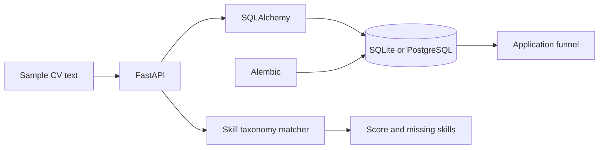

# Architecture

Keep jobs and applications in a relational model, calculate reproducible skill overlap, and expose stage counts and saved scores through FastAPI.

A deterministic taxonomy makes scoring explainable. SQLAlchemy dependencies allow isolated API tests. Database uniqueness protects against duplicate applications, and Alembic migrations read the same environment configuration as the app.

## Execution boundaries

The taxonomy does not infer synonyms, assess experience quality, or predict hiring outcomes. There is no authentication, multi-user isolation, PDF CV parser, or LLM integration. Create an application before analyzing a CV to persist its score. Keep this local when using personal information.

Tests use disposable SQLite stores. Live demos use public or fictional input. Container checks use a separate PostgreSQL service. See [execution evidence](results/demo.json) and [verification status](results/verification.md).
