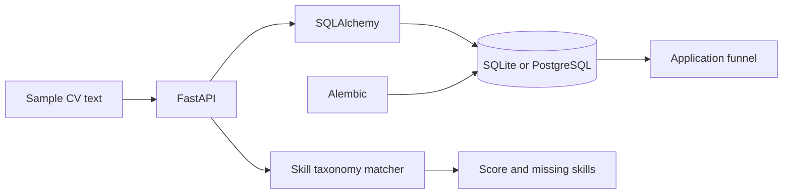

# Architecture

```mermaid
flowchart LR
  CV[Sample CV text] --> API[FastAPI]
  API --> Match[Skill taxonomy matcher]
  API --> ORM[SQLAlchemy]
  ORM --> DB[(SQLite or PostgreSQL)]
  Match --> Score[Score and missing skills]
  DB --> Analytics[Application funnel]
  Alembic --> DB
```

The API separates vacancies, application state, and matching. Analytics aggregates saved application data.

See [design decisions](decisions.md) for tradeoffs.
